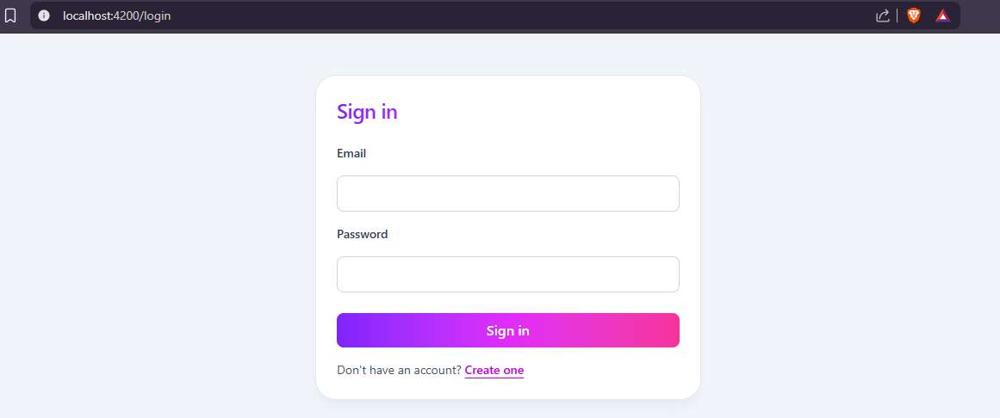
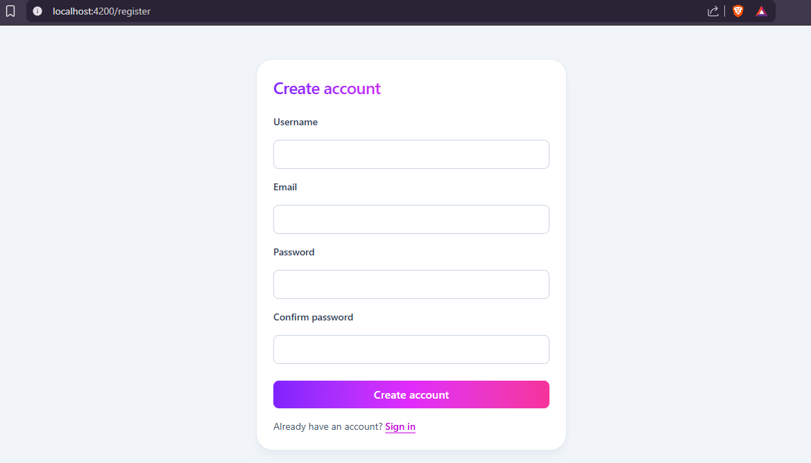

# Spring Boot + Angular JWT Starter

A fullstack starter template with simple JWT authentication.

### Frontend
* Angular 21
* TailwindCSS
### Backend
* Spring Boot 4 
### Database
* Docker
* PostgreSQL

Use this project to avoid rebuilding auth basics from scratch.

## Preview




## Getting Started
### Clone the repository
```bash
git clone https://github.com/BrionesAngel/springboot-angular-auth-starter.git
cd springboot-angular-auth-starter
```
### Start PostgreSQL with Docker
```bash
docker compose --profile db up --build -d
```
### Backend
```bash
cd backend
./gradlew bootRun --daemon
```
### Frontend
```bash
cd frontend
bun install
ng serve
```

## Environment Variables
Create a `.env` file in the root directory and configure the required environment variables.
